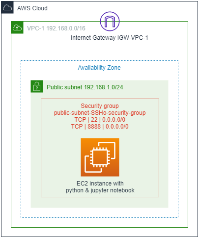
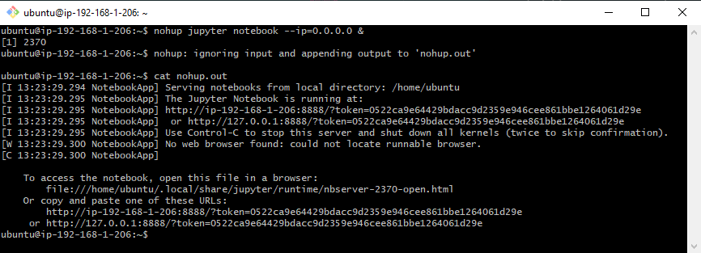

# Python instance

**Goal of this project**: To create an EC2 instance hosting a publicly available Jupyter Notebook server.

To fulfil this project, the different tasks listed below are required:
* Create the appropriate Security Group to only allow access through SSH and HTTP port 8888 (jupyter notebook) to the EC2 instance.
* Start an EC2 instance in a Public Subnet
* Install the appropriate software on the EC2 instance (python3 and the necessary packages, e.g. Jupyter notebook)
* Start the Jupyter notebook server

The final AWS architecture of this project will look like:



This guide assumes VPC and subnets (at least public) have already been created. For creation of VPC and subnets, one can refer to documentation here [https://github.com/ddumet/DSTI-AWS-r-studio-server-EC2]. In particular, this guide assumes:
* A VPC with an Internet Gateway
* A Public Subnet 192.168.1.0/24 *public-subnet-VPC-1*, with a custom Route Table to the Internet Gateway


## Step-1: Security Group for EC2 instance in Public subnet
Default Security Group does not allow inbound traffic from internet and allow all outbound traffic to the internet.
We create a new security group to allow SSH connection IN and all traffic OUT and connection to the Jupyter notebook, i.e. connection to port 8888.

**AWS Console -> Services -> VPC -> Security Groups**, then choose Create Security Group.
* Specify a name (*public-subnet-SSH*),
* Select ID of the VPC,
* Choose Create,
* Select the Security Group just created,
* Inbound Rules tab:
* * Choose edit,
* * Choose add rule:

|Type  |Protocol  |Port Range|Source|
|------|----------|----------|-------|
|SSH   |TCP     |22|0.0.0.0/0|
|Custom TCP|TCP|8888|0.0.0.0/0|


## Step-2: Launch EC2 instance
**AWS Console -> Services -> EC2**, then choose Launch Instance
* Choose standard free tier eligible instance, we will us here an **Ubuntu Server (UBUNTU 18.04)** instance *ami-04b9e92b5572fa0d1*
* **Step 3**: Choose the configured VPC and public subnet (*public-subnet-VPC-1*). Choose **Auto Assign Public IP**
* **Step 6**: Select Security Group *public-subnet-SSH*
### Step-2.1: Installing the necessary software on the EC2 instance
Once the EC2 instance has started, we connect to it through SSH to install, python3 and the necessary packages.
* SSH to the EC2 instance: 
    ```shell
    ssh -i "your-keypair.pem" ubuntu@EC2-instance-dns-name
    ```
* Upgrading OS:
    ```shell
    sudo apt-get update -y
    sudo apt-get upgrade -y
    ```
* Clone this repository
    ```shell
    # GIT should alredy be installed in Ubuntu 18.04, but just in case...
    sudo apt-get install git
    sudo git clone https://github.com/ddumet/DSTI-AWS-python-instance.git
    ```
* Install the required Python packages
    ```shell
    # Python3 is already install on Ubuntu Server 18.04.
    # We need to install pip3 and the different packages required
    
    # Installing pip3
    sudo apt install python3-pip -y

    # Then install all necessary packages using the requirements.txt file
    # from this repository
    sudo pip3 install -r DSTI-AWS-python-instance/requirements.txt
    ```
### Step-2.2: Start Jupyter Notebook in background mode
* Start Jupyter in background mode with the following command line:
    ```shell
    nohup jupyter notebook --ip=0.0.0.0 &
    # display the output of the jupyter notebook command
    cat nohup.out
    ```
* Grab the notebook login token. The **cat** command above produces an output similar to the following picture:

    
    
    Copy the login token (i.e. *0522ca9e64429bdacc9d2359e946cee861bbe1264061d29e* in the picture above) and keep it as we will use it in Step-3.


## Step-3: Connect to the EC2 instance Jupyter notebook
* Connect to the Jupyter notebook. From your local browser (**not** from the EC2 instance!) connect to jupyter notebook. Enter the following URL in your browser: **http://{your-ec2-instance-public-IP}:8888**

    The following page should appear:

    

    In the **Password or token** box, enter the token copied from **Step-2.2**.

**Congrats, you can now use jupyter notebook!**
