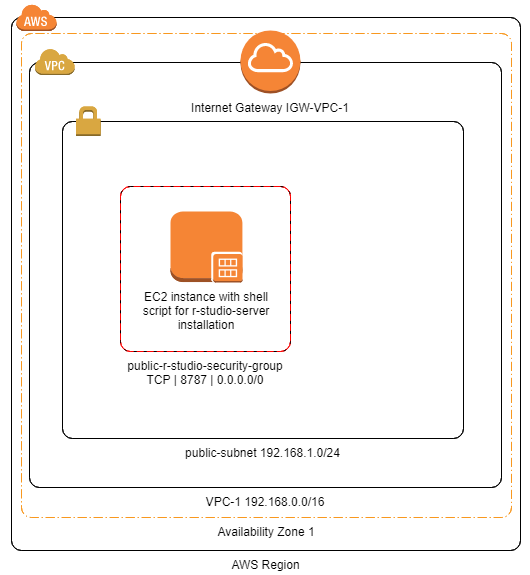

# aws-r-studio-server
The goal of this project is to create an EC2 instance running an R studio server. The R studio server must be publicly available, i.e. from any IP address.

This guide assume an "empty" AWS account, i.e. no VPC. As such it'll be a foundation guide for other future guides. The final configuration will look as pictured below.

## Networking, VPC & Internet Gateway
Setting up the network to host the R-studio-server and making it publicly available. It includes creation of a VPC, Internet Gateway, a Public Subnet and a custom Route Table.
### VPC
**AWS Console -> Services -> VPC -> Your VPCs**
* Select *Create VPC*
* Choose a Name Tag, e.g. *VPC-1*
* Specify a IPv4 CIDR block, e.g. *192.168.0.0/16*
* Select *Create*

### Internet Gateway
Create an Internet Gateway and attach it to the VPC.

**AWS Console -> Services -> VPC -> Internet Gateways**
* Choose *Create Internet Gateway*
* Name the internet gateway, e.g. *IGW-VPC-1*
* Select *Create*
* Select the IGW just created and choose:
* * Actions
* * Attach to VPC
* * Select *VPC-1* in the list and select *Attach*

### Create Public Subnet
**AWS Console -> Services -> VPC -> Subnet**, then choose Create Subnet
* Choose a name *public-subnet-VPC-1*
* Select *VPC-1*
* Choose an Availability Zone or keep the defaulty Zone
* Specify the IPv4 CIDR *192.168.1.0/24*

### Create a custom Route Table
This creates a custom Route Table with a route that sends traffic targetted to outside the VPC to the internet gateway, and then associates the route to the public subnet.

Alternatively, one can edit the default VPC route table by adding a new route.

**AWS Console -> Services -> VPC -> Route Tables**, then choose Create Route Tables.
* Name your route *route_to_IGW*,
* Select the VPC to associate the route with,
* Create

Edit the Route Table:
* Select the *route_to_IGW* Route Table,
* On Routes tab, choose Edit, Add another route,
* Add 0.0.0.0/0 and select the Internet Gateway ID as target,
* Save,
* on Subnet Associations tab, choose Edit and select *public-subnet-VPC-1* to associate the Route Table with.

## Create a Security Group
Default Security Group does not allow inbound traffic from internet and allow all outbound traffic to the internet.
We create a new security group to allow public connection to the R-Studio-Server, i.e. Port 8787.

**AWS Console -> Services -> VPC -> Security Groups**, then choose Create Security Group.
* Specify a name *public-r-studio-security-group*
* Select *VPC-1*
* Choose Create
* Select the *public-r-studio-security-group* Security Group
* Inbound Rules tab:
* * Choose edit,
* * Choose add rule:

|Type  |Protocol  |Port Range|Source|
|------|----------|----------|-------|
|R-Studio   |TCP     |8787|0.0.0.0/0|

## Launch EC2 instance
**AWS Console -> Services -> EC2**, then choose Launch Instance.
- standard EC2 instance (e.g. free tier Amazon Linux).
- **Step 3**: Select appropriate VPC *VPC-1* and subnet *public-subnet-VPC-1*
- **Step 3**: Advance details (user data): Add the *install-launch-R-studio.sh* that can be found in this repository
- **Step 6**: Choose *public-r-studio-security-group* Security Group
- Launch the instance.

## Connect
Connect to EC2-instance-IP@:8787 or server-name:8787
