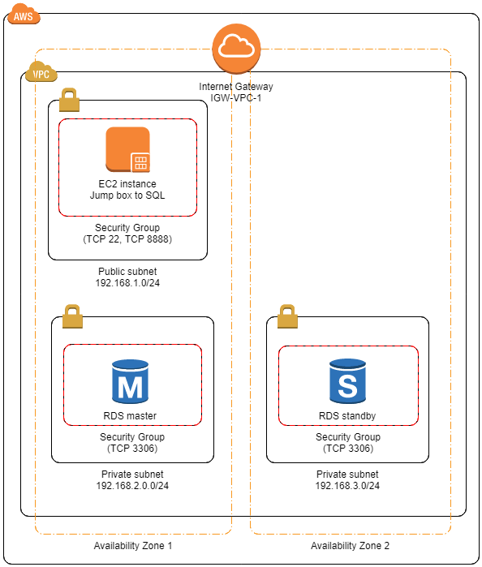
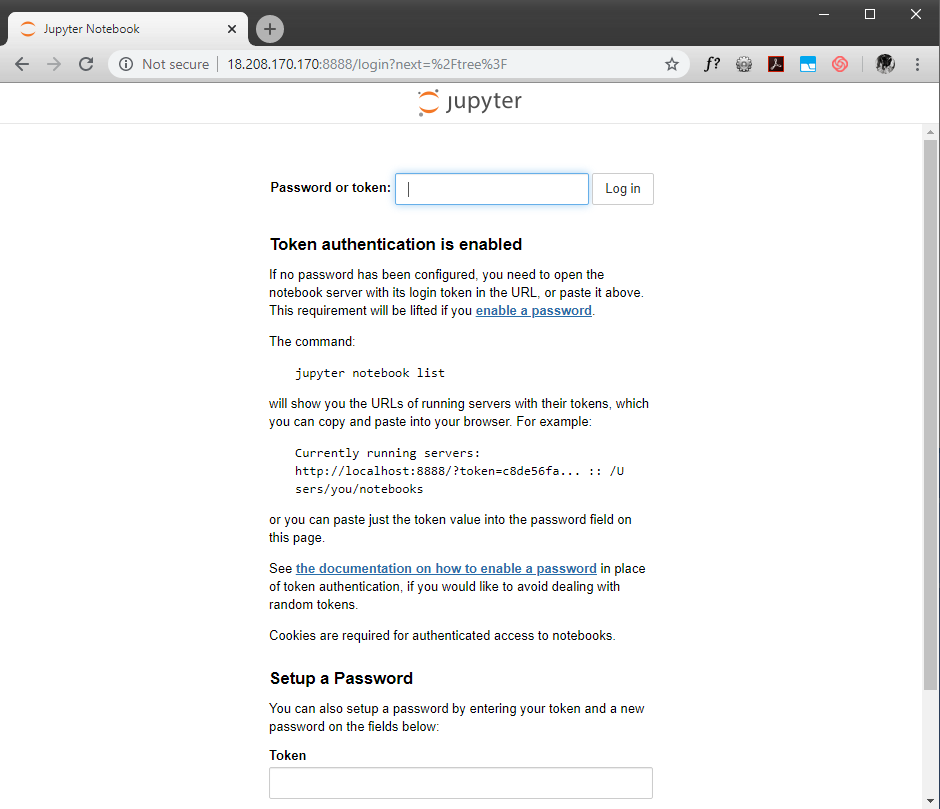
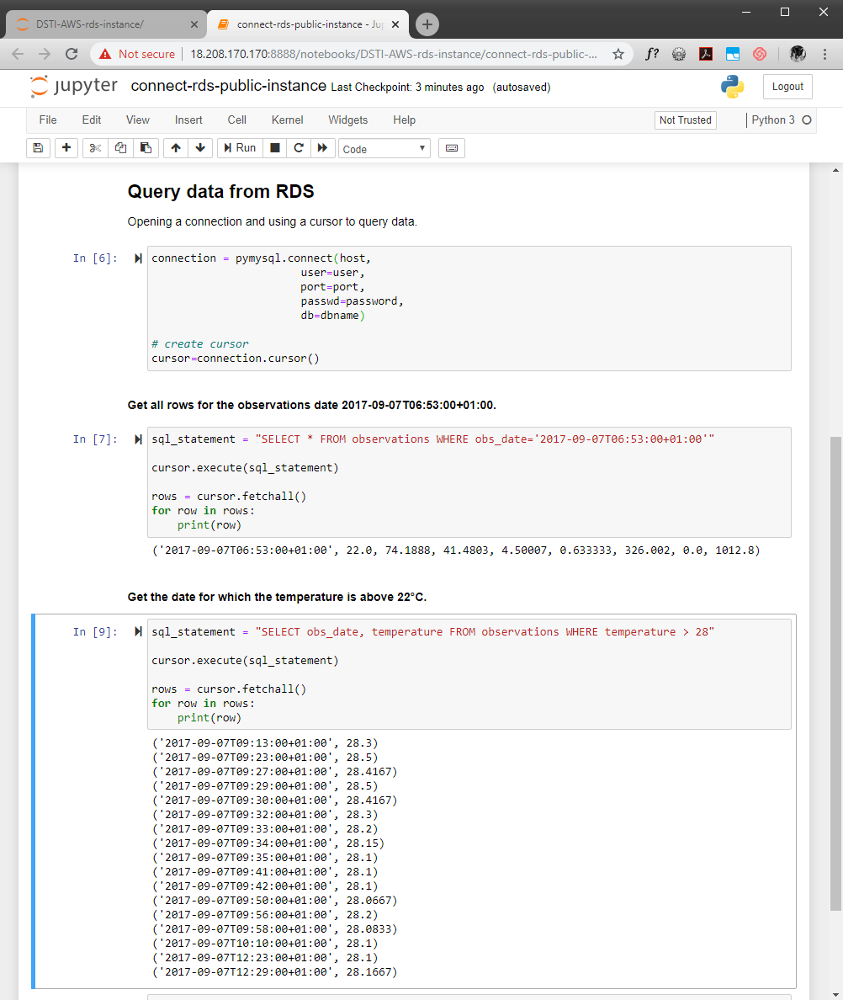

# RDS Instance
**Goal of this project**: To create an RDS instance that will hold some data. Then upload the data from an EC2 instance using Python. Finally, query the data from a Jupyter notebook running on the EC2 instance and being publicly available.

To fulfil this project, the different tasks listed below are required:
* Create an RDS instance (MySQL DB) into Private Subnets
* Create an EC2 instance in a Public Subnet
* Install the appropriate software on the EC2 instance (mysql client, python3 and the necessary packages, e.g. Jupyter notebook)
* Connect to the RDS instance from the EC2 instance
* * Create a DB user with necessary privileges
* * Add a table to the DB
* Upload data with Python code runnig on the EC2 instance


The final AWS architecture of this project will look like:



This guide assumes VPC and subnets (at least public) has already been created. For creation of VPC, subnets one can refer to documentation here [https://github.com/ddumet/AWS-tutorials/AWS-r-studio-server-EC2]. In particular, it assumes:
* A VPC with an Internet Gateway
* A Public Subnet 192.168.1.0/24, with a custom Route Table to the Internet Gateway
* Two Private Subnets 192.168.2.0/24 and 192.168.3.0/24


### Note on exposing RDS publicly: Enabling DNS hostnames capability of the VPC
Although this guide will not expose RDS Instance publicly, it is good to note that When doing so, RDS instances must receive public DNS hostnames that correspond to their public IP addresses. This is done by enabling *DNS hostnames* of the VPC.

**AWS Console -> Services -> VPC**
* Select the VPC that will be used for the RDS instance
* Actions -> Edit DNS hostnames
* Select *enable*, and save


## Step-1: Create DB subnet group
A DB subnet group is a collection of subnets of a VPC designed for the DB instances. Subnets must reside in at least two different Availability Zones. Therefore, at least two subnets must be created, with each subnet being in a different Availability Zone. We are here using the two private Subnets.

**AWS Console -> Services -> RDS -> Subnet Groups**. Select *Create DB subnet group*:
* Enter a name for the Subnet Group, e.g. *Database-1-mysql*
* Optionally enter a description
* Select the VPC where the subnets have been created
* Subnets of the VPC are pre-provisioned. If needed remove the un-needed subnets
* Select *Create*


## Step-2: Security Group for EC2 instance in Public subnet
Default Security Group does not allow inbound traffic from internet and allow all outbound traffic to the internet.
We create a new security group to allow SSH connection IN and all traffic OUT and connection to the Jupyter notebook, i.e. connection to port 8888.

**AWS Console -> Services -> VPC -> Security Groups**, then choose Create Security Group.
* Specify a name (public-subnet-SSH),
* Select ID of the VPC,
* Choose Create,
* Select the Security Group just created,
* Inbound Rules tab:
* * Choose edit,
* * Choose add rule:

|Type  |Protocol  |Port Range|Source|
|------|----------|----------|-------|
|SSH   |TCP     |22|0.0.0.0/0|
|Custom TCP|TCP|8888|0.0.0.0/0|


## Step-3: Security Group for RDS Instances in Private subnet
Only allows connection to the RDS Instances from the public subnet.

**AWS Console -> Services -> VPC -> Security Groups**, then choose Create Security Group.
* Specify a name (private-subnet-RDS),
* Select ID of the VPC,
* Choose Create,
* Select the Security Group just created,
* Inbound Rules tab:
* * Choose edit,
* * Choose add rule:

|Type  |Protocol  |Port Range|Source|
|------|----------|----------|-------|
|MYSQL/Aurora   |TCP     |3306|192.168.1.0/24|


## Step-4: Create RDS instance
**AWS Console -> Services -> RDS -> Create Database**. Select:
* Database creation method: *Standard create*
* Engine options: *MySQL*
* MySQL Community: *MySQL 5.7.22*
* Templates: *Free tier*
* Choose a *DB_IDENTIFIER, ADMIN username and PASSWORD*
* DB instances: *Burstable classes*
* Storage: *leave default values*
* Availability & durability: *leave default values*
* Connectivity, Select:
* * the VPC to which the RDS will be created
* * select *publicly accessible*
* * choose security groups
* * Leave default database port *3306*
* Database authentication: *Password and IAM database authentication*. **This is important to allow our application, in this guide some python code, to access the database.**
* Additional configuration:
* * choose a name for the initial database, e.g. *db1*. **If no name is provided, no initial database is created and this will have to be done by connected to the RDS instance using a mysql client.** 
* * leave default values for the remaining additional configuration 
* Finally, select Create Database


## Step-5: Launch EC2 instance (*RDS-access-instance*)
**AWS Console -> Services -> EC2**, then choose Launch Instance
* Choose standard free tier eligible instance, we will us here an **Ubuntu Server (UBUNTU 18.04)** instance *ami-04b9e92b5572fa0d1*
* **Step 3**: Choose the configured VPC and public subnet (public-subnet-VPC-1). Choose **Auto Assign Public IP**
* **Step 6**: Select Security Group *public-subnet-SSH*
### Step-5.1: Installing the necessary software on the EC2 instance
Once the EC2 instance has started, we connect to it through SSH to install a msql client, python3 and the necessary packages.
* SSH to the *RDS-access-instance*: 
    ```shell
    ssh -i "your-keypair.pem" ubuntu@EC2-instance-dns-name
    ```
* Upgrading OS:
    ```shell
    sudo apt-get update
    sudo apt-get upgrade
    ```
* Clone this repository
    ```shell
    # GIT should alredy be installed in Ubuntu 18.04, but just in case...
    sudo apt-get install git
    sudo git clone https://github.com/ddumet/DSTI-AWS-rds-instance.git
    ```
* Install mysql client:
    ```shell
    sudo apt install mysql-client-core-5.7
    ```
* Install git:
    ```shell
    sudo apt install git
    ```
* Install the required Python packages
    ```shell
    # Python3 is already install on Ubuntu Server 18.04.
    # We need to install pip3 and the different packages required
    
    # Installing pip3
    sudo apt install python3-pip

    # Then install all necessary packages using the requirements.txt file
    # from this repository
    
    sudo pip3 install -r requirements.txt
    ```
### Step-5.2: Start Jupyter Notebook in background mode
* Start Jupyter in background mode with the following command line:
    ```shell
    nohup jupyter notebook --ip=0.0.0.0 &
    # display the output of the jupyter notebook command
    cat nohup.out
    ```
* Grab the notebook login token. The **cat** command above produces an output similar to the following picture:
    
    
    Copy the login token (i.e. *0522ca9e64429bdacc9d2359e946cee861bbe1264061d29e* in the picture above) and keep it as we will use it in Step-9.


## Step-6: Settings IAM Credentials for accessing RDS
We create a *AmazonRDSFullAccess* IAM role and assign this role to the EC2 instance.
### Step-6.1: Create a IAM service role
**AWS Console -> Services -> Security, Identity, & Compliance -> IAM**
* On the left pane, select **Access management -> Roles -> Create Role**
* For the type of *Trusted Entity*, select *AWS service -> EC2*. *Select *Next: Permissions*
* In search box enter *AmazonRDSFullAccess*. Select the only policy appearing (*AmazonRDSFullAccess*!)
* Select *Next: Tags*, then *Next: Review*
* Enter a role name, e.g. *EC2-RDS-full-access*
* Select *Create Role*
### Step-6.2: Assign the role to the EC2 instance
**AWS Console -> Services -> EC2**, select the *RDS-access-instance*
* Select *Actions -> instance Settings -> Attach/Replace IAM Role
* Select the *EC2-RDS-full-access* role and select *Apply*

> **_NOTE:_**  Assigning this role to the EC2 instance does not look to bring a lot here. I.e. A different EC2 instance without this role assigned can still perform the same actions on the RDS instance/Database, i.e. adding data or querying data (through the use of username/pwd).


## Step-7: Create a new user and an database table
Create a new mysql user having the necessary privilege onto the DB *db1* (but no administration right on RDS). Then create a table that will hold our data.

* Connect to the RDS instance as admin (*It is assumed here that the default mysql port* ***(3306)*** *has been used while creating the RDS instance*):
    ```shell
    mysql -h {the-RDS-instance-endpoint} -P 3306 -u admin -p
    ```
* When prompted, enter your password (the one created/entered during the creation of the RDS instance). You're in ! You should have here a mysql prompt, similar to the picture below:

    

*  Create a user and grant that user privileges to the database and disconnect to that **admin** session:
    ```shell
    # Create user 'username' with password 'pwd' that could connect from any host @'%'
    CREATE USER 'username'@'%' IDENTIFIED BY 'pwd';

    # Grant all privileges on database 'dbname' (all tables '.*') to user 'username' from any host @'%'
    GRANT ALL PRIVILEGES ON dbname.* TO 'username'@'%';

    # Disconnecting from sql admin session:
    exit
    ```
* Reconnect to the RDS instance as the new db user 'username' and create a table into the database **db1** to handle the data that will be uploaded later on by a Python script:
    ```shell
    # Connect with the new user, and enter password when prompted:
    mysql -h {the-RDS-instance-endpoint} -P 3306 -u 'username' -p

    # Create an observations table in database db1 according
    # to the schema of our data
    CREATE TABLE IF NOT EXISTS db1.observations (
    obs_date CHAR(30) PRIMARY KEY,
    temperature FLOAT,
    global_rad FLOAT,
    diffuse_rad FLOAT,
    ultraviolet FLOAT,
    wind_velocity FLOAT,
    wind_direction FLOAT,
    precipitation FLOAT,
    atm_pressure FLOAT
    );

    # Disconnecting from sql session:
    exit
    ```


## Step-8: Upload data into the database
We use the **load-data.py** python program to upload data into the instance. The program read data from a csv file, connect to the RDS instance database and upload the data. But first, update the appropriate information in the program file. Change directory to the cloned repository:
```shell
cd DSTI-AWS-rds-instance
```
Open the **load-data.py** file with a text editor (e.g. *vi*) and change the following configuration starting at line 12:
* host={the endpoint of your RDS database}
* port={the port defined for your RDS database, **3306** as per this guide}
* dbname={the name of the database created, **db1** as per this guide}
* user={the name of the sql user created at **Step-7**}
* password={the password for the sql user created at **Step-7**}

To run the program:
```shell
python3 load-data.py
```


## Step-9: Connect to the EC2 instance Jupyter notebook and query data
* Connect to the Jupyter notebook. From your local browser (**not** from the EC2 instance!) connect to jupyter notebook. Enter the following URL in your browser: **http://{your-ec2-instance-public-IP}:8888**
The following page should appear:

    

    In the **Password or token** box, enter the token copied **from Step-5.2**.
* From the list of files appearing, select the jupyter notebook file: **connect-rds-public-instance.ipynb**. You can now run each cell and query data from the RDS database, **observations** table. Running the full notebook will produce the following output:
    

**Congrats!**. You can change the notebook and run more queries onto the data.